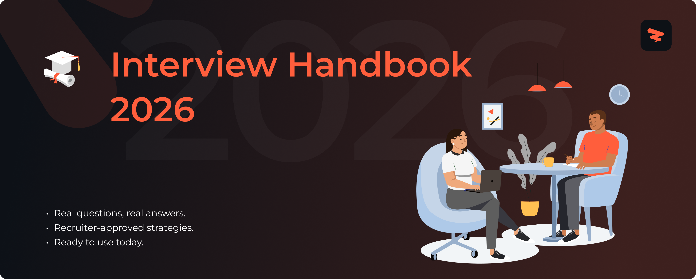

# 
Interview Handbook 2026

Roughly speaking, we can divide interview questions into three main categories: behavioral questions, technical questions, and curveballs. 
  
> 🤝 The goal of <i>behavioral questions</i> is to gauge your skills, abilities, and personality. They want to see how your past behavior reflects and predicts your future behavior. Ultimately, it’s about determining a cultural fit.
  
> 🛠️ <i>Techncial questions</i> are used to judge your technical knowledge and expertise. Do you have the necessary foundation to solve highly complex problems on the spot or not?
  
> 🎲 And <i>curveballs</i> are surprise questions through which the company wants to see how you react to a sudden situation.

Let’s go over some common behavioral, technical, and curveball questions you can expect in an interview.

> [!NOTE]
> The questions we’re sharing are only a sample. Interviewers can go off script and ask vastly different questions. It shouldn’t be taken as a hard and fast rule that you’ll always be asked these questions.

> [!TIP]
> While you don't need to memorize answers, have a sense of what experiences you would share and how to describe them to the interviewer. You'll want your examples to be both clear and succinct.

  This repo is maintained in collaboration with 

---

## **Website & Autofill Extension**

Explore Zapply's website and check out:

- Our chrome extension that autofills your job applications in seconds.
- A dedicated job board with the latest jobs for various types of roles.
- User account providing multiple profiles for different resume roles.
- Job application tracking with streaks to unlock commitment awards.

Experience an advanced career journey with us! 🚀

  
  &nbsp;&nbsp;&nbsp;&nbsp;
  

---

## Explore Around

Connect and seek advice from a growing network of fellow students and new grads.

  
  &nbsp;&nbsp;
  
  &nbsp;&nbsp;
  

---

## Table of Contents

- [Behavioral Questions](#behavioral-questions)
  - [Teamwork](#teamwork) — Example 1
  - [Client-Facing Skills](#client-facing-skills) — Example 2
  - [Ability to Adapt](#ability-to-adapt) — Examples 3–7
  - [Time Management Skills](#time-management-skills) — Example 8
  - [Communication Skills](#communication-skills) — Example 9
  - [Motivation and Values](#motivation-and-values) — Examples 10–17
- [Technical Questions](#technical-questions)
- [Curveball Questions](#curveball-questions)
  - [Questions that Put Interviewees at Ease](#questions-that-put-interviewees-at-ease) — Example 18
  - [Questions that Self-Promote](#questions-that-self-promote) — Examples 19–20
  - [Questions that are Nearly Impossible to Answer](#questions-that-are-nearly-impossible-to-answer) — Example 21
  - [Questions Regarding Office Situations](#questions-regarding-office-situations) — Examples 22–23
  - [Personal and Revealing Questions](#personal-and-revealing-questions) — Examples 24–25
- [End-of-Interview Questions](#end-of-interview-questions)
  - [Company-Specific Questions](#company-specific-questions)
  - [Role-Specific Questions](#role-specific-questions)
  - [Wrap-Up Questions](#wrap-up-questions)

---

## Behavioral Questions

Interviewers ask behavioral questions to know about your past work and see if you have the skills needed for the job. They assume that your behavior in the past reflects how you will behave in the future. 

To answer these questions, use the <i>CAR (challenge, action, result)</i> approach. When describing a past accomplishment, provide a challenge you were facing, the action you took to solve it, and the end result you achieved. 

The following behavioral questions may be asked to discern your personality and soft skills, and whether they align with the company’s values:

---

### Teamwork

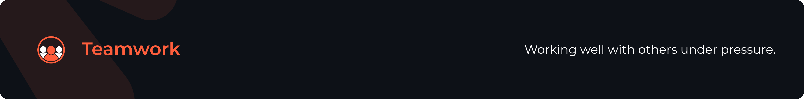

For questions like these, you want a story that illustrates your ability to work with others under challenging circumstances. Think team conflict, difficult project constraints, or clashing personalities.

- Have you handled a difficult situation with a co-worker? How?
- What do you do if you disagree with a co-worker?
- Share an example of how you were able to motivate employees or co-workers.
- Have you handled a difficult situation with a supervisor? How?
- Have you handled a difficult situation with another department? How?
- What do you do if you disagree with your boss?

Mention an experience that showcases your ability to work in a team. You can describe a time when you voluntarily helped a fellow employee. Or an academic project that you undertook and completed successfully as a team. Make sure you don't mention other team members in a negative connotation.

---

#### 📌 Example 1: Give an example of how you've worked on a team.

> [!TIP]
> **Good Answer:** "One of my projects was really time-intensive. Even though me and my peers had divided tasks equally, one of the team members was facing an issue and her task was delayed. I voluntarily helped her solve the problem and we were able to submit the project in time."

> [!WARNING]
> **Bad Answer:** "My teammates were struggling so I carried the project."

---

### Client-Facing Skills

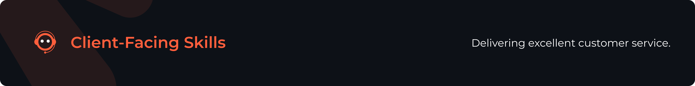

If the role you're interviewing for works with clients, definitely be ready for one of these. Find an example of a time where you successfully represented your company or team and delivered excellent client service.

- Have you handled a difficult situation with a client or vendor? How?
- Give me an example of a time when you did not meet a client's expectation. What happened, and how did you attempt to rectify the situation?
- Tell me about a time when you made sure a customer was pleased with your service.
- Describe a time when you had to interact with a difficult client. What was the situation, and how did you handle it?
- When you're working with a large number of customers, it's tricky to deliver excellent service to them all. How do you go about prioritizing your customers' needs?

You can mention a time when you resolved a difficult situation with a client and were able to retain the customer. You can also mention a time when a client was exceptionally satisfied with your service. After describing a situation, you can associate it with your work philosophy with respect to customer service.

---

#### 📌 Example 2: Describe a time when it was especially important to make a good impression on a client. How did you go about doing so?

> [!TIP]
> **Good Answer:** "Based on my customer service, one of my clients voluntarily returned and repaid for a large purchase after an internal system discrepancy caused an incomplete transaction."

> [!WARNING]
> **Bad Answer:** "I made a good impression on all of my clients."

---

### Ability to Adapt

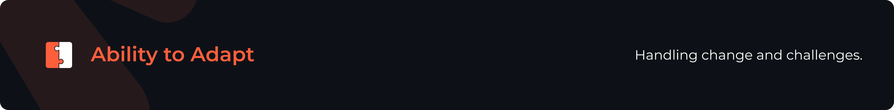

Think of a recent work crisis you successfully navigated. Even if your navigation didn't feel successful at the time, find a lesson or silver lining you took from the situation.

- Give an example of an occasion when you used logic to solve a problem.
- How do you handle a challenge?
- Have you ever made a mistake? How did you handle it?
- Did you ever make a risky decision? Why? How did you handle it?
- What do you do when your schedule is interrupted? Give an example of how you handle it.

Talk about a work task or an academic project that was substantially stressful for you. It may be due to significant workload, a strict deadline, or other responsibilities. You can describe a situation where you had to complete a task and address personal duties while maintaining a healthy work-life balance.

---

#### 📌 Example 3: Tell me about how you worked effectively under pressure.

> [!TIP]
> **Good Answer:** "While pursuing my Bachelor's degree, I had to work on my final year project while taking care of my newborn child. Managing both tasks simultaneously was especially stressful however, both my grades and my expertise in economics prove my persistence."

> [!WARNING]
> **Bad Answer:** "I try not be under pressure when undertaking a task."

These questions also test your ability to handle sudden, changing, or unfortunate scenarios. Maybe you handled an escalating customer conflict, streamlined change management processes, or mitigated an unexpected technical problem.

---

#### 📌 Example 4: Describe a stressful situation and how you handled it.

> [!TIP]
> **Good Answer:** "One of the clients was quite unsatisfied with her purchase and came back to the store to return the item. To avoid a scene, I reacted quickly and used a consultative approach to understand her issue and refund her purchase. Ultimately, she purchased an alternative product based on the way I handled the situation."

> [!WARNING]
> **Bad Answer:** "I don't get stressed while undertaking a task."

---

#### 📌 Example 5: Do you prefer to work alone or with other people?

There's no one answer to this question and being honest is important here. Think of the projects you've worked on in the past. Were you better at working in a group or independently? Maybe you equally excelled in both cases. Either way, you should be able to prove your answer by giving an example of your past experiences. You should also make sure that your answer aligns with the job requirements. For instance, always preferring independent work while applying for a team-oriented job might backfire. Similarly, you shouldn't convey that you're only a team player in an interview for a job that requires individual effort. In any case, the key is to be unbiased towards both options. Even if you prefer one of the two choices, mention that you value the other approach as well.

> [!TIP]
> **Good Answer:** "I am very comfortable working on a team, but I can also work independently, as well."

> [!WARNING]
> **Bad Answer:** "I can't concentrate with other people around me."

---

#### 📌 Example 6: What sort of work environment do you prefer?

The rules to answer this kind of question are quite similar to the ones that work for <i>"Do you prefer to work alone or with other people?"</i> Be honest but unbiased and make sure that your answer aligns with the company's work environment. Moreover, portray yourself as someone who is flexible and adaptable to most kind of environments. However, if there are certain environments that you absolutely cannot work in, say you face difficulty handling them without sounding too biased.

> [!TIP]
> **Good Answer:** "I can be flexible when it comes to my work environment. From your website, it looks like the environment in the engineering department here at RRS, Inc., is fast-paced and structured to expand production. I enjoy working in an area experiencing rapid growth and I think this kind of environment is conducive to new ideas and applications."

> [!WARNING]
> **Bad Answer:** "I absolutely cannot work in a fast-paced environment."

---

#### 📌 Example 7: Describe a recent/important project you worked on.

By answering this question, you can showcase how you handle difficult situations, resolve challenges, and use your work ethic to handle stress. When preparing for this question, make a list of all the major projects you undertook in your career. Select the ones that are relevant to the job requirements and think about your responsibilities based on the CAR (challenge, action, result) approach. Mention the challenge you were facing, the actions you took to tackle them, and the end result you achieved.

While mentioning a project, be concise and specific, and explain your role and accomplishments clearly without sounding arrogant. You shouldn't mention what your team members did and you shouldn't blame them either. Finally, discuss what the project taught you in a positive light instead of focusing on the negatives or things you disliked about the project.

> [!TIP]
> **Good Answer:** "My company did not have a proper way of maintaining client documents. There were paper files and records all over the place. After identifying this issue, I hired a database specialist and collaborated with him to store all the client information in a single, consolidated database. Moreover, I transitioned company data onto a cloud-based platform. By doing so, I improved the accuracy, integrity, and accessibility of data."

> [!WARNING]
> **Bad Answer:** "I worked on a project to design a web application. I worked on the frontend and my team member worked on the backend. I used HTML and CSS to create the frontend whereas he was using PHP. He was lagging behind so I helped him finish the backend to finish the project in time."

---

### Time Management Skills

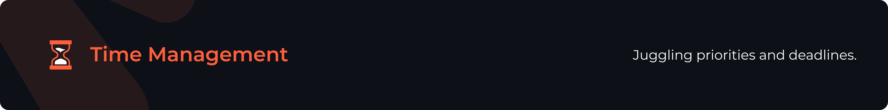

Talk about a time you juggled multiple responsibilities, organized it all (perfectly), and completed everything before the deadline.

- Did you ever postpone making a decision? Why?
- When you worked on multiple projects how did you prioritize?
- Tell me about a time your responsibilities got a little overwhelming. What did you do?
- Tell me about a time you set a goal for yourself. How did you go about ensuring that you would meet your objective?
- Describe a long-term project that you managed. How did you keep everything moving along in a timely manner?

Describe a time when you completed a task perfectly within the expected deadline. You can also mention a situation where you had to juggle multiple tasks at once. Even if the deadline for a task wasn't strict, you can talk about a scenario when you completed that task to optimize your time for other duties.

---

#### 📌 Example 8: How did you handle meeting a tight deadline?

> [!TIP]
> **Good Answer:** "One of my recent projects was quite substantial with a really strict deadline. However, I made it digestible for myself by dividing it into tasks with dedicated deadlines using Excel and a time tracking tool."

> [!WARNING]
> **Bad Answer:** "I complete all tasks with perfection even if it takes more time."

---

### Communication Skills

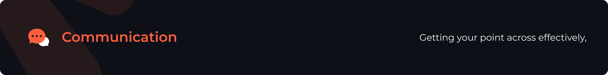

You probably won't have any trouble thinking of a story for communication questions, since it's not only part of most jobs; it's part of everyday life. However, the thing to remember here is to also talk about your thought process or preparation.

- Describe a decision you made that was unpopular and how you handled implementing it.
- Have you ever dealt with company policy you weren't in agreement with? How?
- Have you had to convince a team to work on a project they weren't thrilled about? How?
- Tell me about a successful presentation you gave and why you think it was a hit.
- Describe a time when you were the resident technical expert. What did you do to make sure everyone was able to understand you?
- Tell me about a time when you had to rely on written communication to get your ideas across to your team.

Give examples where you got your point across effectively, listened carefully, or used your negotiation skills to resolve a conflict or facilitate a change. You can also showcase your presentation and written communication abilities by answering this question.

---

#### 📌 Example 9: Do you listen? Give an example of when you did or when you didn't listen.

> [!TIP]
> **Good Answer:** "As a sales rep, I always listen to my clients' needs before suggesting a product. As an example, one of my clients conveyed his requirements to me in detail but didn't purchase anything. He returned a week later and was pleasantly surprised that I remembered all of his requirements."

> [!WARNING]
> **Bad Answer:** "I only listen to myself." OR "I listen to and act on every coworkers' suggestion."

---

### Motivation and Values

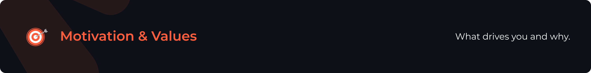

A lot of seemingly random interview questions are actually ways to learn more about what motivates you. Your response would ideally address this directly even if the question wasn't explicit about it.

- Give an example of a goal you reached and tell me how you achieved it.
- Give an example of a goal you didn't meet and how you handled it.
- Have you been in a situation where you didn't have enough work to do?
- Have you gone above and beyond the call of duty? If so, how?
- Give an example of how you set goals and achieve them.
- Did you ever not meet your goals? Why?

These questions are used to figure out your values and whether they align with the company's vision or not. Remain honest while mentioning your beliefs as you might find a workplace that perfectly aligns with your values. However, don't emphasize beliefs that have negative implications. Focus on your positive motivations and how they add value to the company. While keeping this in mind, make sure to describe a real-life example that proves the value you're mentioning. Otherwise, you might portray a sense of entitlement to the job.

---

#### 📌 Example 10: Give an example of a goal you reached and tell me how you achieved it.

> [!TIP]
> **Good Answer:** "In my recent internship, I set a personal goal to not only accomplish my set objectives for my internship, but also to develop proficiency in a new tool or technology. My objectives for my internship were both completed and I was also able to develop proficiency in Java, which I had previously only used in my classes at school."

> [!WARNING]
> **Bad Answer:** "I've been a gamer since I was a kid and one of my goals was to achieve one of the top ten scores in Minecraft. This past year I was able to score #10 on the global list."

---

#### 📌 Example 11: Tell me about yourself.

This question is the perfect opportunity to sell yourself in an interview. You should avoid talking about your personal story or even explain your work experience in detail. Rather, you need to mention a few accomplishments that help you pitch the employer on why you're the right person for the job.

A good practice is to follow the present-past-future approach. First, talk about the state of your career right now. Then, briefly mention relevant skills you've gained from past experiences. Finally, describe your future aspirations and how they align with this particular opportunity.

> [!TIP]
> **Good Answer:** "Well, I'm currently an account executive at Smith, where I handle our top performing client. Before that, I worked at an agency where I was on three different major national healthcare brands. And while I really enjoyed the work that I did, I'd love the chance to dig in much deeper with one specific healthcare company, which is why I'm so excited about this opportunity with Metro Health Center."

> [!WARNING]
> **Bad Answer:** "I have 2 kids so my daily routine mostly revolves around them." OR "I'm looking for a company that will help me grow." OR "I like coffee and watching football."

---

#### 📌 Example 12: Can you tell me a little more about your current/most recent job?

This question is really a close-ended version of <i>"Tell me about yourself."</i> It is essential to keep the answer concise and avoid unnecessary details. To do so, you should primarily focus on your key accomplishments rather than your job duties. Talk about the ways you helped the company by fulfilling your responsibilities instead of just listing them. You should only talk about accomplishments that relate to the job and make the connection between them and the job requirements as clear as possible.

> [!TIP]
> **Good Answer:** "My day-to-day involves looking at buying data, which has a big impact on how our sales team approaches conversations with potential clients."

> [!WARNING]
> **Bad Answer:** "My day-to-day involves looking at buying data. I look at it, analyze it, and compile it before sending it to the higher-ups."

---

#### 📌 Example 13: Can you describe a typical day at work in your last job?

This question is closely related to <i>"Can you tell me a little more about your current/most recent job?"</i> but has a subtle difference. Instead of primarily talking about your accomplishments, you need to mention your responsibilities. However, avoid describing a long list of duties and focus on the major responsibilities that align with the job you're applying for. Also mention how you were able to meet those duties. Tell the employer that you're successfully completing the job.

> [!TIP]
> **Good Answer:** "In a typical day in my last position I fulfilled management tasks of opening and closing the facility, as well as overseeing a staff of seven individuals. I also provided strong customer service and resolved customer issues."

> [!WARNING]
> **Bad Answer:** "I was responsible for various administrative duties, including answering phones, drafting documents and emails, filing and greeting customers. I was also in charge of maintaining databases, resolving issues, and fixing bugs."

---

#### 📌 Example 14: Tell me again what interests you about this job and what skills you plan to bring to it.

To prepare for questions that are aimed at identifying your skills, read through the job listing and make a list of your skills that match the requirements in the job posting. Then, circle strengths that make you unique and tailor your answer to show that you are well suited for the job because of those strengths. You should show that the job interests you because it requires the unique skills you excel at and thus, you can provide value to the company.

Avoid generic answers that emphasize the job perks or how the job might benefit you. Instead, explain how your skills can relate to and enhance the company's mission.

> [!TIP]
> **Good Answer:** "I am interested in this job as a programmer because I am extremely interested in, and skilled at, learning and excelling at new technologies. I have already learned and mastered programs and languages ranging from Python to Java, and I look forward to mastering more programs as they're developed. I am also interested in creative problem solving, a skill I developed when working as an analyst for the past ten years."

> [!WARNING]
> **Bad Answer:** "I want a job that will help me build my career." OR "The salary package is really good."

---

#### 📌 Example 15: Why did you leave your recent job?

While an honest answer to this question is important, you should avoid potential mistakes. The general rule here is that you should always be leaving to move toward a better opportunity. However, don't make it sound like money or perks are the only things you care about. Shape it based on your career goals and what you want your future work life to look like. However, don't sound impulsive, vague, or scattered in terms of what you want in your career. You should be able to prove that you have a clear goal and are taking steps to pursue it.

Moreover, you should never portray your position as fleeing from a bad opportunity. This means that you should not badmouth your previous employer or the company you worked at. Recruiters might get the impression that you might blame others again if there's a disagreement.

In any case, it's important to step up and take responsibility while conveying that you have a clear vision of your future career goals.

> [!TIP]
> **Good Answer:** "I had been with the organization for a number of years and wanted to experience a new environment to continue growing." OR "I reevaluated my career goals and decided a change was needed."

> [!WARNING]
> **Bad Answer:** "The salary wasn't good enough." OR "My boss didn't care about his staff's personal lives."

---

#### 📌 Example 16: What would you consider an acceptable salary for this position?

There are multiple ways to answer this question, but each of them requires some research. You should provide not only a number you're comfortable with but the appropriate compensation for the job based on real data. Indeed, Payscale, Glassdoor, and Salary are some resources you can use to find out the appropriate salaries for jobs in your respective area.

Providing a specific number may hinder your chances at getting a good compensation package or even the job. If your salary expectation is too high, the recruiters might reject you. If it's too low, you might lose a better offer. You can use some techniques to avoid these situations. Firstly, you can offer a salary range. Keep in mind, however, that the employer might opt for the lower end of the range. So, make sure your target is as close to the bottom as possible. Secondly, you can include other negotiation options. If you think your salary target is higher than what the job might be offering, you can request the negotiation of additional benefits. Finally, if you're still unsure about the specifics of job duties and salary expectations, you can deflect the question for later in the interview. However, you might still need to answer the question eventually.

> [!TIP]
> **Good Answer:** "After researching the market, I am seeking a position that pays between $75,000 and $80,000 annually." OR "I am seeking a position that pays between $75,000 and $80,000 annually but I am open to negotiate salary depending on benefits, bonuses, equity, stock options, and other opportunities." OR "Before I answer, I'd like to ask a few more questions to get a better idea of what the position entails. That way, I can provide a more realistic expectation."

> [!WARNING]
> **Bad Answer:** "I want more than what I'm getting paid in my current job." OR "Whatever you deem fit." OR "I'd like to skip that question."

---

#### 📌 Example 17: If you got the job, what would you do in your first year to establish yourself?

A way more common alternative to this question is, <i>"What would you accomplish in your first 30/60/90 days on the job?"</i> To answer these questions, you'll need to research the company, similar job listings, and employee resumes to know what the industry requires from new hires.

Set realistic goals and don't make yourself seem too overconfident or passive. Unless the job specifically calls for it, avoid focusing on overhauling the current work environment or procedures. Instead, show that you're eager to learn at the start, thoroughly understand and adhere to the company's mission, and finally contribute to the organization's mission. Whatever the case, give the impression that you have a clear sense of direction.

> [!TIP]
> **Good Answer:** "In addition to getting to know the team and getting fully up to speed with the role, there's a lot I want to accomplish during my first three months in the role of editor. During my first 30 days, I want to get a sense of our blog's editorial goals and use those to create a new blog design. After 60 days, I want our blog redesign launched and to have at least 50 contributors writing for the website. After 90 days, I want to switch the efforts from building the team to tracking growth, and I'm hoping that we can have 100,000 unique visitors by then through utilizing our marketing channels and those of our contributors."

> [!WARNING]
> **Bad Answer:** "I guess I'll have to wait and see." OR "I'll transform and revamp company processes." OR "I'll observe and learn new things."

In case you're unsure of the exact goals the company wants you to accomplish, you should have a generic backup answer ready similar to this one:

> [!TIP]
> "Within 30 days, I plan to get to know the people I'll be working with the most and to be comfortable with them. Within 60 days, I plan to have a solid understanding of the industry, the company and the competitive landscape so that I can hold my own in any conversation about the company. Within 90 days, I plan to meet the goals that have been set for me."

---

The best way to answer any behavioral question is with an anecdote. Given the fact that you're a fresh graduate, you can use examples from your academic or everyday life to answer some of the questions. For example, if you get asked, <i>"How do you handle a challenge?"</i> You can talk about a challenge you addressed during your studies or in your everyday life that was hindering you in some way. It's not necessary to always answer such questions with an example from your working experience.

---

## Technical Questions

Employers are interested in your industry expertise and how you approach problems; their technical questions are designed to identify your thought process. Below are common technical questions for entry-level software engineers:

**🧱 Data Structures & Algorithms**
- What is the difference between an array and a linked list?
- What is the difference between a stack and a queue?
- Explain Big O notation and time complexity.
- How would you implement a binary search algorithm?
- Explain what recursion is and give an example.
- What are hash tables and when would you use them?

**📦 Object-Oriented Programming**
- What are the four pillars of object-oriented programming?
- What is the difference between a class and an object?
- Explain inheritance vs composition.

**🗄️ Databases**
- What is the difference between SQL and NoSQL databases?
- What is SQL injection and how do you prevent it?
- Explain what database indexing is and why it matters.

**🌐 Web Development**
- Explain the difference between GET and POST requests.
- What is a RESTful API and what makes it RESTful?
- What is the difference between synchronous and asynchronous programming?
- What is JSON and how is it different from XML?
- Explain CORS and why it exists.

**⚙️ DevOps & Tools**
- Explain what version control is and why Git is important.
- What is Docker and why is it useful?
- Explain what CI/CD is and why it matters.
- What is the difference between unit testing and integration testing?

**📐 System Design (Basic)**
- How would you design a URL shortener?
- What is caching and when would you use it?
- What is the difference between IaaS, PaaS, and SaaS?

**✍️ Coding Challenges**
- Write a function to reverse a string.
- Write a function to check if a string is a palindrome.
- How would you find the largest number in an array?
- Write a function to detect a cycle in a linked list.

**🤖 Emerging Topics**
- What are LLMs and how might you integrate one into an application?
- What is prompt engineering?

These questions cover fundamental computer science concepts, programming basics, web development principles, DevOps practices, and common coding challenges that entry-level candidates should be familiar with.

You can research the most common technical questions that interviewers ask in your respective industry using Google, Claude, or ChatGPT.

---

## Curveball Questions

Curveball questions are surprise/trick questions that are meant to see how you tackle difficult and sudden situations. They can be tough questions that make you hesitate to share the whole truth out of fear of creating a poor image or they can be utterly random questions meant to throw you off guard. The key point is that you shouldn't be afraid of them. The way to answer curveball questions is to not jump at an answer since interviewers are looking at the quality of your thinking. You want to present the facts in a straightforward fashion and then turn the situation around to demonstrate growth.

For example, one of the most common curveball/tough questions is <i>"What is your weakness?"</i> A common error people make is saying <i>"I don't have any weakness."</i> This is categorically false because we're human. We all have weaknesses. So, saying this implies you don't want to share your true weakness and you're playing defensive. Another common error is presenting a "fake" weakness. It won't be a true weakness. For example, if you say your weakness is being a perfectionist, that raises the question of how? How is being a perfectionist your weakness? If you fail to present your case adequately, then you've failed to answer the question appropriately.

For the specific question shared above, you want to straightforwardly present your weakness. <i>"I struggle with managing my time appropriately which often results in me having to do overtime to complete the task."</i> That's a proper weakness where you've explained how it creates problems for you. Next you must explain how you're working to overcome this weakness. <i>"But I've started keeping track of my time to see at what stage of the process I'm spending the most time on. I've realized I spend too much time doing research because I go a little off-track from the requirements so, I've been keeping an eye there. It's helped me cut down my overtime at least. And I'm not spending an extra 3 hours a day on my job."</i>

Here's another variation to the above question: <i>"Tell us about a time you failed."</i> Your first instinct would naturally be <i>"Oh I don't want to tell them about a time I failed! That'll create a bad impression."</i> But how you structure your answer is what will prevent this from happening. You want to honestly share an example of a time you failed without sugarcoating it, and then how you overcame that situation. What learning occurred as a result? What lessons were learned? That shows that you're someone who isn't afraid of making mistakes but also, most importantly, you see every opportunity as a way to grow.

The way to answer curveball questions is to not jump at an answer since interviewers are looking at the quality of your thinking. Following are a few categories of curveball questions:

---

### Questions that Put Interviewees at Ease

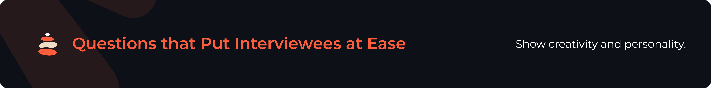

- If you could have one superpower, what would you choose?
- If you could be a kitchen utensil, what would you be and why?
- Would you rather fight an elephant-sized pigeon or five hundred pigeon-sized elephants?

These questions are aimed at identifying your creativity. There are no "correct" answers for these types of questions so try to keep your answer creative and possibly tie it with a skill required for the job. They want to gauge your personality and ability to think on the spot. It's not <i>what</i> you answer, but <i>how</i> you answer that counts.

---

#### 📌 Example 18: If you were an animal, what kind of animal would you be and why?

> [!TIP]
> **Good Answer:** "I think I'd be a duck. They're always calm on the surface, but hustling like crazy to get things done underneath."

> [!WARNING]
> **Bad Answer:** "Definitely a Tiger. Grrrr…"

---

### Questions that Self-Promote

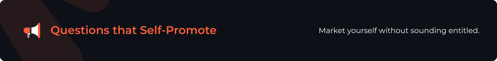

- Why should we hire you instead of the other people who applied for this job?
- If you owned this company what would you change?
- Rate this interview, on a scale from 1 to 10 and explain how you would improve it.

These questions show how you market yourself. It's difficult to promote yourself without suggesting that you feel entitled to the position. To answer these questions, it's best to complement other possible interviewees and showcase strengths that you bring to a team.

Additionally, when you're demonstrating your worth, you want to speak of the skills that the company is looking for in their candidate. Be straightforward about your strengths in relation to the company's needs. For example, if asked, <i>"Why you should be hired?"</i> You can state the three skills you hold that are critical to doing the job well.

The key point to remember is that you don't want to badmouth anybody in your interview – not your past company, peers, boss, or even your fellow candidates. Focus on your positive attributes and strengths and do not shy from your bad sides. Accept them and then tell the interviewer how you're working on improving those weak spots. This demonstrates an honest personality who accepts responsibility, is thoughtful, and is someone who learns from their mistakes. All of these are vital characteristics companies seek from their employees because that's how you gain loyal employees.

---

#### 📌 Example 19: Is it better to be perfect and late, or good and on time?

> [!TIP]
> **Good Answer:** "I'd rather be good and on time since I believe perfection is not really attainable. And if I'm part of a team, I always prioritize meeting their expectations so I wouldn't want to be late."

> [!WARNING]
> **Bad Answer:** "I always aim for perfection in every situation."

Besides your skills, these questions are also asked to determine your character. Again, you have to position your answer so that you neither feel entitled nor underqualified. You can try to explain your positive character by relating it to your coworkers.

---

#### 📌 Example 20: Would you rather be liked or feared?

> [!TIP]
> **Good Answer:** "Well I certainly wouldn't want to be feared. Personally, I think fear is a terrible motivator, and could lead to some uncomfortable situations. Everyone wants to be liked, but it isn't always possible. Sometimes you have to do unpopular things to get the job done. I'd much sooner be respected, but have my co-workers understand that I always do my best for the team as a whole."

> [!WARNING]
> **Bad Answer:** "I want people to be afraid of how much they like me."

---

### Questions that are Nearly Impossible to Answer

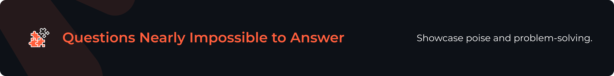

- How many windows are in Manhattan?
- How would you sell ice cream in Alaska?
- Suppose you had $2,000 and needed to double it in 24 hours, what would you do?

These kinds of questions are used to determine poise, creativity, and problem-solving. You need to demonstrate adaptability and give in-depth, insightful responses. These questions may have a variety of different answers depending on your problem-solving and thinking ability.

Here's something to remember for such questions. You have to make assumptions and share them with the interviewer. Or you can ask the interviewer, <i>"When you're asking me how to sell ice cream, do you mean ice creams in tubs or popsicles and such?"</i> Get as much clarity as you can and then answer the question.

Another point to remember. You can ask for a short amount of time to think/structure your answer! You can ask for a couple of seconds, 30 seconds, or even a minute. If you need a piece of paper to do some calculations, don't be afraid to ask for it!

And finally, if there's any question that stumps you and you can't figure out an answer in the moment, you can ask <i>"Can we come back to this please? I don't have an answer right now."</i> It takes a lot of strength to admit that you don't have an answer yet. And you're showing that you're not just going to jump into an answer because it's demanded of you. Candidates show that they're thoughtful, organized individuals by following this approach.

---

#### 📌 Example 21: Why are manhole covers round?

> [!TIP]
> **Good Answer:** "A round manhole cover cannot fall through its circular opening." OR "Circular covers don't need to be rotated or precisely aligned when placing them on the opening." OR "A round manhole cover is easily moved and rolled." OR "It's easier to dig a circular hole."

> [!WARNING]
> **Bad Answer:** "I've seen manholes with a lot of other shapes. They include square and rectangular ones."

---

### Questions Regarding Office Situations

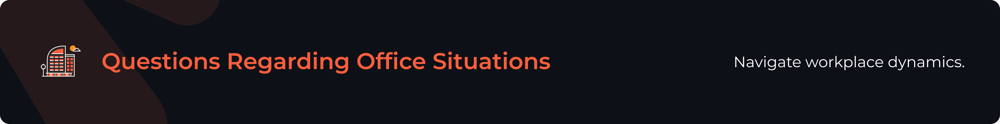

- Tell me about a time when you disagreed with your coworkers about the next steps in a project.
- When was the last time you were in a fight with a coworker?

Office situation questions reveal how well you react in certain office conditions. You should convey what role you can play in real-life office situations. You should showcase your ability to resolve coworker issues through your communication, negotiation, and teamwork skills.

Again, the key point is that you <i>don't</i> want to badmouth your peer. That creates a poor image of you and how you are as a team member. So, you want to be very careful about your word selection. Don't say that your coworker was lazy or dismissive. You can say that they were challenging to work with. They were facing some personal difficulties that were leading to personality clashes. Amplify your positive strengths as a team member and talk about the different ways you helped your peers in those tough situations. You want to show that you're a thoughtful person who doesn't disrespect people, values business ethics, and respects their peers.

---

#### 📌 Example 22: How would you handle firing someone?

Through this question, recruiters want to see how you are in a leadership position. How do you handle the tough calls? Do you do it with grace, with bluntness, or do you fumble it? You want to showcase your strengths as a leader – someone who isn't afraid to make tough choices, maintains focus on achievement of the end goal, but also takes all efforts to help someone to prevent this final step.

> [!TIP]
> **Good Answer:** "As a communicative manager, I would take steps to avoid the point of firing such as corrective action, improvement opportunities, and internal trainings. If firing is the only option, I would convey the information in a calm and empathetic yet factual manner."

> [!WARNING]
> **Bad Answer:** "I would send them a termination email."

---

#### 📌 Example 23: Have you ever been in a work situation where you were asked to do something unethical?

You need to show your integrity and your ability to analyze and resolve problems when answering this question. Pick a case of ethical conflict that is not ambiguous, subjective, or questionable. Rather, choose a conflict in which ethical lines were clearly drawn. While explaining your case, avoid throwing yourself or someone specific under the bus.

You might feel the urge to say you haven't encountered this type of situation. However, the interviewer may probe further with: <i>"You really have never faced any ethical conflicts in your life?"</i> Clearly, we all have, so it is best to select the simplest example in advance.

> [!TIP]
> **Good Answer:** "We had a difficult situation in my last job where some information came to light about improper hiring evaluation practices on the part of one of my coworkers. That person asked me not to say anything about it, yet it was a clear violation of our hiring practices, so I reported it to my manager, who then reported it to HR. It was handled per our company policy from that point forward."

> [!WARNING]
> **Bad Answer:** "It was probably the time that I was accused of over inflating expenses on my expense reporting by someone who wanted my job. She was just trying to make trouble, so I hacked into the expense reporting system and found out that she had some questionable expenses as well. It all kind of blew up and it was a pretty messy situation, but I defended myself. When all was said and done, I did lose my job over it, but I would do it the same all over again."

---

### Personal and Revealing Questions

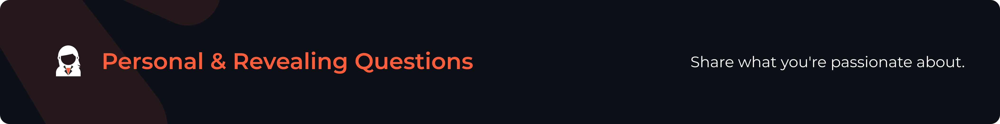

- What's your favorite website?
- When have you been happiest in your life?
- What's the best trip you've ever taken?
- If you could turn into another person, who would you choose to be?

Personal questions reveal things that you're passionate about. These questions don't have a right or wrong answer so be honest and find a way to align the question with the skills required for the job. Talk about things that excite you as they relate to the job. But you don't have to <i>force</i> this connection either. If it's not connected to the job, it's still fine!

---

#### 📌 Example 24: What gets you up in the morning?

> [!TIP]
> **Good Answer:** "I'm currently managing the [blank] project." OR "Right now, I'm pursuing the [blank] certification." OR "I'm learning the [blank] skill nowadays. I'm really excited to complete this activity since it complements my previous experience and aligns with the opportunities I'm looking for."

> [!WARNING]
> **Bad Answer:** "Coffee."

These questions are also used to see how you get out of a difficult situation. You can use humor to break the tension while reassuring your value.

---

#### 📌 Example 25: Every resume has one lie in it. What's yours?

> [!TIP]
> **Good Answer:** "OK, so 'active lifestyle' may have been a bit of a stretch. I do go and sit in the sauna in my gym from time-to-time, if that counts? On a serious note though, I don't believe there are any lies on my resume. I believe integrity is very important and that starts with your resume."

> [!WARNING]
> **Bad Answer:** "I don't have any lies on the resume." OR "There might be one or two inaccuracies."

---

## End-of-Interview Questions

At the end of an interview, candidates are typically asked where do they see themselves in one, five, or ten years. You want to give a specific answer instead of a vague one like, <i>"I would like to work in a company where I can use my strengths to drive growth and grow my career."</i> That doesn't tell the recruiter anything specific about your goals or what you've got planned for your career path.

You want to be as specific as possible, from pinpointing a specific position you want to have within the defined period, to identifying which field you want to focus on, and to even roughly defining what kind of work you hope to be doing in that timeframe. So, the best answers always showcase what career trajectory you want to take. This is why it is important to remember to give an answer that is realistic. If a candidate comes in and says that he wants to be a Senior Manager within a year, that's unrealistic! However, if you say that within a year, you'd like to have led a team through delivery of at least two projects in your area of expertise, that's more realistic.

The last question you may be asked is if you have any questions that you would like to ask. Typically speaking, people tend to ask when they can expect a reply. That isn't a bad thing to ask but it's also not the best thing to ask either. It ends the interview on a selfish note. The interviewer might think that you're only interested in hearing back and not the company itself. Another thing candidates often do is ask for feedback immediately. Or they say, <i>"Is there anything else I can do that will help me stand out from the other candidates?"</i> We don't recommend asking this question first because it may come across as too desperate. You can ask it as the third question but not as the first.

Firstly, we recommend asking 2-3 questions that are focused on showing that you're genuinely interested in the company. This means you want to create the impression that you want to know what's bothering you so that you can help the company. So, you want to talk to the company, not at it. That means you want to frame a question like, <i>"What's the main challenge I'll be expected to help solve?"</i> Alternatively, you can show your genuine interest by asking, <i>"How will my performance be measured in the first 90 days?</i>" If you're curious about the company environment, another thing you can ask the interviewer is, <i>"What's your favorite thing about this company? What keeps you coming back here every day?"</i> Remember! An interview is a two-way street. You're judging if you want to work with this company as much as they are trying to figure out if you're a good cultural fit.

There are a ton of other questions you can ask at the end of an interview. Here are some more examples:

---

### Company-Specific Questions

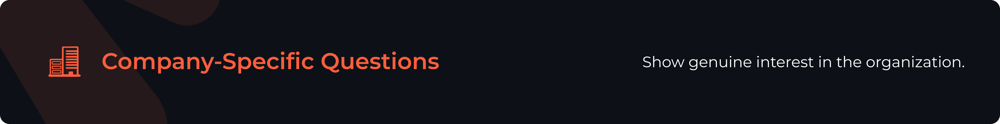

These questions relate to the organization itself and are fine to ask in almost any interview.

- What makes working at this company special?
- How do you see this company/industry evolving in the next 5 to 10 years?
- I know one of the company's values is [blank]. How is that defined and demonstrated here at the company?
- What qualities and attributes make for a successful employee here?

---

### Role-Specific Questions

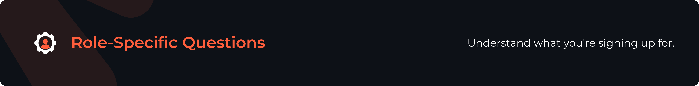

These questions are specific to the position you're interviewing for so be careful when asking them and research as much as you can about the role beforehand. For example, asking about the day-to-day responsibilities of a role is appropriate for a consulting position but would seem out of place during an interview for a sales job, where the primary responsibilities involve reaching out to potential clients and selling the company's products.

- What are the day-to-day responsibilities of this job?
- What is the most challenging aspect of the job?
- What does the ideal candidate for this role look like?

---

### Wrap-Up Questions

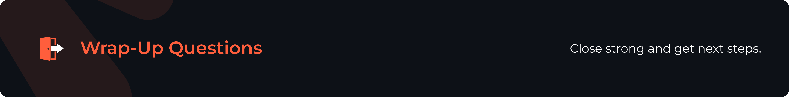

These are great questions to ask as the interview is winding down though again, some are more appropriate for certain interviews than others. For example, if you're interviewing for a junior role, the question about next steps should always be directed to the person who set up your interview in the first place.

- What are the next steps? What is your timeline for making a decision and when should I expect to hear back from you?
- Is there anything else I can provide you with to help you with your decision?
- What's been your best moment at this company?

---

## More Resources

Check out our other repos for jobs and free resources:

  
  &nbsp;&nbsp;
  
  &nbsp;&nbsp;
  

  
  &nbsp;&nbsp;
  
  &nbsp;&nbsp;
  

  
  &nbsp;&nbsp;
  
  &nbsp;&nbsp;
  

---

<b>Found this helpful? Give it a ⭐ to support Zapply!</b>

